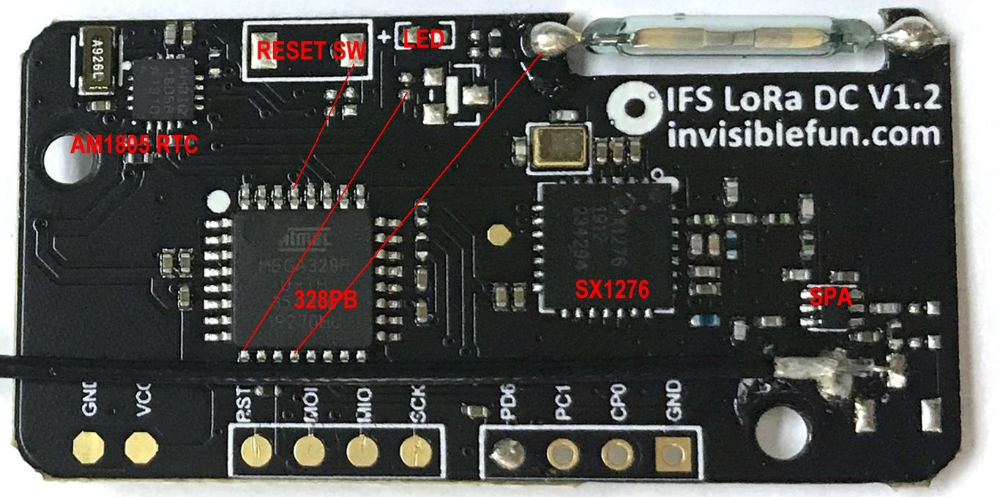

# AVR_IFS_LoRa_328PB_testing

invisiblefun.com Mini LoRa Development Board, generic app

### Disclaimer, 
all those materials in presenting of this repository, either own creation or downloaded from the internet, no affiliation to the manufacturer or their designer.

### hardware  
LED @ PD5, MCU pin9  
reed switch @ PB0, MCU pin12  
IO, PC3 / PC1 PC0 or ADC3 / ADC1 / ADC0  
  

### software source code  
[IFS_LoRa_328PB_testing.ino](IFS_LoRa_328PB_testing.ino)  

### compiled firware  
[IFS_LoRa_328PB_testing.ino_atmega328pb_1000000L.hex](IFS_LoRa_328PB_testing.ino_atmega328pb_1000000L.hex)  

### burn hex batch file
[burn.bat](burn.bat)  

### [AB1805.ino_atmega328pb_1000000L_115200BAUD_CAL.hex](AB1805.ino_atmega328pb_1000000L_115200BAUD_CAL.hex)
special firmware, dump OSCCAL to terminal, baud rate 115200 N81
